<h3>Building intelligent systems from simulation to silicon.</h3>

AI/ML Engineer in Hanoi specializing in <b>deep reinforcement learning</b>,
<b>TinyML</b>, and reliable model deployment on resource-constrained hardware.

## Profile

> AI/ML Engineer focused on turning research models into practical intelligent systems for **robotics and edge devices**.

- 🎯 **Direction:** Robot motion control, simulation-based AI training, Edge AI, and embedded machine learning.
- 🔬 **Research experience:** Deep reinforcement learning for autonomous UAV trajectory planning.
- ⚙️ **Engineering strength:** End-to-end model development — from training and optimization to deployment and benchmarking.
- 🎓 **Education:** B.S. in Information Technology, HUST · Vietnam–Japan Program · **GPA 3.52/4.00**.

## Core expertise

- **Reinforcement Learning & Robotics** — DDPG, TD3, continuous control, reward design, curriculum learning, and Artificial Potential Fields.
- **Edge AI & TinyML** — TensorFlow Lite, TFLite Micro, Edge Impulse, ESP32-S3, and on-device inference.
- **Model Optimization** — INT8 quantization, pruning, latency and memory benchmarking, and Pareto-based model selection.
- **AI Engineering** — PyTorch, TensorFlow, NumPy, pandas, scikit-learn, Matplotlib, and Weights & Biases.

## Featured projects

### 🩺 TinyML for Vital-Sign Analysis

**Graduation thesis** · Deployed risk-classification models directly on the ESP32-S3.

- Optimized SVM and MLP models with Random Fourier Features, INT8 quantization, and pruning.
- Benchmarked accuracy, latency, flash, and RAM to identify the best model through a Pareto frontier.

`C/C++` · `Python` · `TensorFlow Lite Micro` · `ESP32-S3`

### 🌱 Smart Plant Care with Edge AI

**Embedded AI system** · Forecasted temperature on-device from historical sensor data.

- Built FreeRTOS firmware for sensing, actuator control, MQTT communication, and ML inference.
- Trained and deployed an LSTM model to the ESP32-S3 using Edge Impulse.

`C/C++` · `FreeRTOS` · `MQTT` · `Edge Impulse`

### 🎥 Video Meeting Platform

**Backend and DevOps** · Built secure services and an automated deployment pipeline.

- Developed REST APIs, JWT authentication, and authorization with Spring Security.
- Containerized the system and deployed it through GitHub Actions, Docker, Nginx, and SSL.

`Java` · `Spring Boot` · `PostgreSQL` · `Docker` · [Project organization →](https://github.com/CNWeb-20251)

## Technology stack

### 🧠 AI / Machine Learning

`PyTorch` · `TensorFlow` · `scikit-learn` · `NumPy` · `pandas` · `Matplotlib`

- Model training, evaluation, visualization, quantization, pruning, and performance benchmarking.

### 🤖 Reinforcement Learning & Simulation

`DDPG` · `TD3` · `OpenAI Gym` · `Artificial Potential Field` · `Weights & Biases`

- Continuous control, reward engineering, curriculum learning, and UAV trajectory planning.

### ⚡ Edge AI & Embedded Systems

`TensorFlow Lite` · `TFLite Micro` · `Edge Impulse` · `ESP32-S3` · `FreeRTOS` · `Arduino` · `MQTT` · `UART`

- On-device inference, embedded firmware, sensor pipelines, and resource-aware model deployment.

### 💻 Programming & Backend

`Python` · `C` · `C++` · `Java` · `TypeScript` · `Spring Boot` · `REST APIs` · `PostgreSQL`

- AI pipelines, embedded development, backend services, authentication, and data persistence.

### 🚀 DevOps & Engineering Tools

`Docker` · `GitHub Actions` · `Nginx` · `Git` · `Linux` · `Anaconda`

- Containerization, CI/CD, server configuration, experiment environments, and deployment.

## Explore my work

See my pinned projects and GitHub's native contribution activity below this profile.

---

### Open to building intelligent systems that move from research to the real world.

**AI/ML Engineering · Robotics · Reinforcement Learning · Edge AI**

